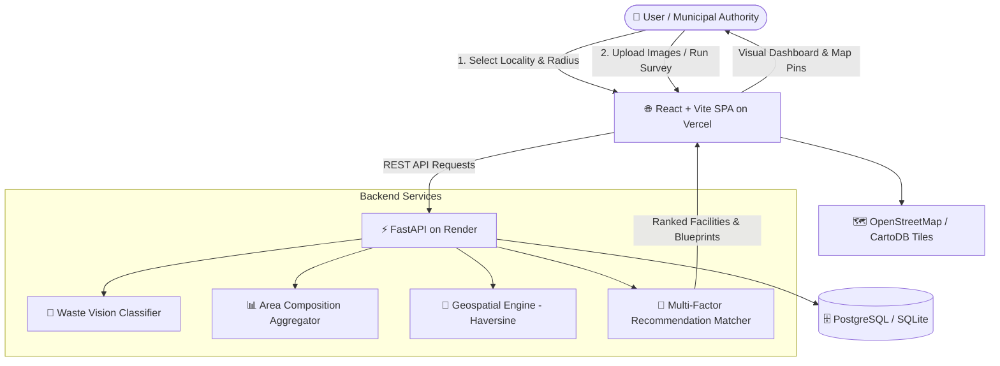

# 🌿 EcoRecycle AI — Spatial Waste Intelligence & Recycling Recommender

[](https://fastapi.tiangolo.com/)
[](https://reactjs.org/)
[](https://vitejs.dev/)
[](https://leafletjs.com/)
[](https://www.postgresql.org/)
[](https://www.python.org/)

> **A Deep Learning-powered spatial waste intelligence system that analyzes waste composition within a selected geographical area and connects identified waste categories with geographically accessible recycling facilities based on material compatibility, processing capability, capacity, and distance.**

Built following [EcoRecycle_AI_PRD.md](file:///d:/DeepLearning/EcoRecycle_AI_PRD.md) and tracked via [TASKS.md](file:///d:/DeepLearning/TASKS.md).

---

## 📑 Table of Contents
1. [System Architecture](#-system-architecture)
2. [Core Innovations & Features](#-core-innovations--features)
3. [Mathematical & Algorithmic Formulations](#-mathematical--algorithmic-formulations)
4. [Technology Stack](#-technology-stack)
5. [Database Schema & Entity Relationship](#-database-schema)
6. [API Endpoints Reference](#-api-endpoints-reference)
7. [Installation & Local Setup](#-installation--local-setup)
8. [Automated Verification & Testing](#-automated-verification--testing)
9. [Cloud Deployment Guide (Vercel & Render)](#-cloud-deployment-guide)
10. [Target Users & Impact](#-target-users--impact)

---

## 🏗️ System Architecture



---

## 🌟 Core Innovations & Features

1. **Deep Learning Waste Classification:**
   - Detects 10 standardized material classes: `Plastic`, `Paper`, `Cardboard`, `Glass`, `Metal`, `Organic`, `Textile`, `E-waste`, `Wood`, `Other`.
   - Returns predicted category, confidence score, specific detected sub-object (e.g. *PET Bottle*, *Corrugated Box*, *PCB Board*), and recyclability flag.
2. **Multi-Image Area Waste Composition Engine:**
   - Aggregates multi-image surveys (e.g. 100 images) to compute real area percentage distribution rather than single-item inference.
3. **Geospatial Recommendation Engine:**
   - Geodesic Haversine distance from selected geographical area center (Karad, Satara, Kolhapur, Sangli, Pune, etc.).
   - Multi-factor suitability score combining material compatibility, proximity, and facility capacity.
4. **Interactive Leaflet Map:**
   - Renders search radius boundary circle and color-coded facility pins with interactive popup cards.
5. **Recycling Process Blueprints:**
   - Domain knowledge base providing industrial methods (e.g., Mechanical pelletizing, hydrapulping, biomethanation) and carbon savings metrics.
6. **1-Click PRD Benchmark Simulation:**
   - Integrated button to immediately simulate the official 100-item Karad survey benchmark from PRD Section 10 (32% Plastic, 28% Organic, 18% Paper, 12% Glass, 7% Metal, 3% E-waste).

---

## 📐 Mathematical & Algorithmic Formulations

### 1. Area Waste Composition Formula (PRD Section 11)
For each waste category $i$:
$$\text{WasteShare}_i = \frac{\text{Count}_i}{\text{TotalWasteItems}} \times 100$$

### 2. Geodesic Distance (Haversine Formula — PRD Section 15)
$$d = 2R \arcsin\left(\sqrt{\sin^2\left(\frac{\Delta\phi}{2}\right) + \cos(\phi_1)\cos(\phi_2)\sin^2\left(\frac{\Delta\lambda}{2}\right)}\right)$$
Where:
- $R = 6,371 \text{ km}$ (Earth's mean radius)
- $\phi_1, \phi_2$ = latitudes in radians
- $\Delta\lambda$ = longitude difference in radians

### 3. Multi-Factor Recommendation Score (PRD Section 17)
$$\text{Score} = W_c \cdot C + W_d \cdot D + W_k \cdot K$$
Where:
- $C \in \{0, 1\}$ = Material compatibility flag ($W_c = 0.45$)
- $D = \max\left(0, 1 - \frac{\text{distance}}{\text{radius}}\right)$ = Proximity decay factor ($W_d = 0.35$)
- $K = \min\left(1, \frac{\text{capacity\_tpd}}{100}\right)$ = Facility capacity availability ($W_k = 0.20$)

---

## 🛠️ Technology Stack

| Layer | Technology | Purpose |
|---|---|---|
| **Frontend** | React 19 + Vite | Fast, modern client SPA |
| **Styling** | Vanilla CSS Design Tokens | Glassmorphic, modern dark mode eco-tech aesthetic |
| **Mapping** | Leaflet + OpenStreetMap | Interactive spatial boundary and facility pins |
| **Icons** | Lucide React | Clean, modern iconography |
| **Backend** | Python 3.11+ / FastAPI | High-performance asynchronous REST API |
| **Web Server** | Uvicorn | ASGI production server |
| **ORM** | SQLAlchemy 2.0 | Type-safe database queries |
| **Database** | PostgreSQL / SQLite | Relational facility and analysis session storage |
| **Computer Vision** | MobileNetV3 / EfficientNet-B0 | Low-latency transfer learning waste classifier |
| **Testing** | Pytest + HTTPX | Automated unit and integration testing |
| **Cloud Hosting** | Vercel (FE) + Render (BE) | Scalable production deployment |

---

## 🗄️ Database Schema

```
+------------------+         +------------------+         +----------------------+
|      users       |         |  waste_analysis  |         | recycling_facilities |
+------------------+         +------------------+         +----------------------+
| id (PK)          |         | id (PK)          |         | id (PK)              |
| name             |         | user_id (FK)     |         | name                 |
| email            |         | latitude         |         | address              |
| password_hash    |         | longitude        |         | latitude             |
| role             |         | area_name        |         | longitude            |
| created_at       |         | radius_km        |         | contact              |
+------------------+         | total_items      |         | capacity_tpd         |
         |                   | created_at       |         | status               |
         | 1:N               +------------------+         | verified             |
         |                            |                   | created_at           |
         v                            | 1:N               +----------------------+
+------------------+                  v                              |
|  waste_results   |<-----------------+                              | 1:N
+------------------+                                                 v
| id (PK)          |                                      +----------------------+
| analysis_id (FK) |                                      | facility_waste_types |
| waste_type       |                                      +----------------------+
| confidence       |                                      | id (PK)              |
| quantity         |                                      | facility_id (FK)     |
| detected_object  |                                      | waste_type           |
| created_at       |                                      | processing_method    |
+------------------+                                      +----------------------+
```

The schema is defined in [`database/schema.sql`](file:///d:/DeepLearning/database/schema.sql) and mapped via SQLAlchemy in [`backend/app/models/models.py`](file:///d:/DeepLearning/backend/app/models/models.py).

---

## 🔌 API Endpoints Reference

Base URL: `http://127.0.0.1:8000`  
Interactive Swagger UI: `http://127.0.0.1:8000/docs`

| Method | Endpoint | Description |
|---|---|---|
| `GET` | `/api/v1/health` | Service health status & total indexed facilities count |
| `POST` | `/api/v1/analyze/image` | Classify a single multipart waste photo |
| `POST` | `/api/v1/analyze/batch` | Upload multiple images; compute composition shares & persist session |
| `GET` | `/api/v1/facilities/nearby` | Spatial query returning facilities within radius filtered by waste type |
| `POST` | `/api/v1/recommendations` | Industrial recycling recommendation & ranked facility matching |
| `POST` | `/api/v1/area/analyze` | Geospatial area summary with all facilities inside the perimeter |

### Example: Single Image Analysis
```bash
curl -X POST "http://127.0.0.1:8000/api/v1/analyze/image" \
  -F "image=@sample_bottle.jpg"
```
**Response:**
```json
{
  "waste_type": "plastic",
  "confidence": 0.94,
  "detected_object": "PET Beverage Bottle",
  "recyclable": true
}
```

### Example: Nearby Facility Query
```bash
curl -X GET "http://127.0.0.1:8000/api/v1/facilities/nearby?latitude=17.2880&longitude=74.1920&radius_km=25&waste_type=plastic"
```
**Response:**
```json
[
  {
    "id": "c1f7b0a1...",
    "name": "Sahyadri Eco-Plast Industries",
    "address": "MIDC Phase 2, Ogalewadi, Karad, Maharashtra 415105",
    "distance_km": 1.37,
    "capacity_tpd": 25.0,
    "suitability_score": 89.2,
    "accepted_waste": ["plastic", "cardboard"],
    "processing_methods": {
      "plastic": "Mechanical Shredding & Pelletizing"
    }
  }
]
```

---

## 💻 Installation & Local Setup

### Prerequisites
- Python 3.11+
- Node.js 18+ and npm

### 1. Clone & Setup Workspace
```bash
cd d:/DeepLearning
```

### 2. Start the Backend API
```bash
# Install dependencies
pip install -r backend/requirements.txt

# Start Uvicorn development server
python -m uvicorn backend.app.main:app --host 127.0.0.1 --port 8000 --reload
```
*Note: The SQLite database (`ecorecycle.db`) will be automatically created and seeded with Western Maharashtra facilities on initial launch.*

### 3. Start the Frontend Application
```bash
cd frontend
npm install
npm run dev
```
Open **[http://localhost:5173](http://localhost:5173)** in your browser.

---

## 🧪 Automated Verification & Testing

Run the full pytest suite from the project root:
```bash
python -m pytest backend/tests/test_api.py -v
```

### Test Coverage Breakdown:
- `test_haversine_distance`: Validates geodesic calculation against known geographic landmarks.
- `test_suitability_scoring`: Verifies weighting factors ($W_c, W_d, W_k$) and distance decay.
- `test_knowledge_base`: Checks domain recycling mappings and carbon offset values.
- `test_batch_aggregation`: Verifies exact percentage arithmetic on multi-item batches.
- `test_api_health`: Validates database connectivity and facility indexing.
- `test_api_nearby_facilities`: Tests radius filtering and JSON serialization.
- `test_api_recommendations`: Tests industrial process recommendations.
- `test_api_single_image_analysis`: Tests multipart file upload and classification output.

---

## ☁️ Cloud Deployment Guide

### Frontend Deployment (Vercel)
1. Import the repository in [Vercel](https://vercel.com).
2. Set Root Directory to `frontend`.
3. Set Framework Preset to **Vite**.
4. Add Environment Variable:
   ```env
   VITE_API_BASE_URL=https://your-backend-app.onrender.com
   ```
5. Deploy. (The included [`frontend/vercel.json`](file:///d:/DeepLearning/frontend/vercel.json) handles SPA routing rewrites automatically).

### Backend Deployment (Render)
1. In [Render](https://render.com), create a new **Web Service** linked to your repository.
2. The included [`render.yaml`](file:///d:/DeepLearning/render.yaml) automatically configures the Python environment, PostgreSQL database, and startup command:
   ```bash
   uvicorn backend.app.main:app --host 0.0.0.0 --port $PORT
   ```
3. Set environment variable `DATABASE_URL` pointing to the managed PostgreSQL database.

---

## 👥 Target Users & Impact

- **General Citizens & Communities:** Identify recyclable components from mixed waste and find the closest drop-off center.
- **Municipal Corporations (e.g., Karad Municipal Council):** Plan localized MRFs (Material Recovery Facilities) based on real-world area composition data.
- **Recycling Industries:** Register capacities, streamline feedstock acquisition, and reduce unnecessary transportation emissions.

---

## 📜 Academic Credits & License
Developed as an MCA Major Project incorporating Deep Learning, Computer Vision, and Geospatial Intelligence for sustainable urban waste management.  
Licensed under the **MIT License**.
