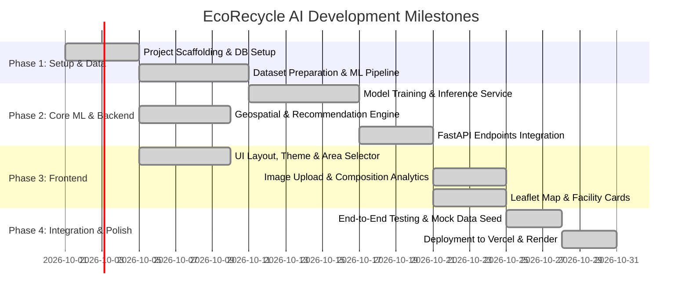

# EcoRecycle AI — Development Tasks & Implementation Roadmap

Based on [EcoRecycle_AI_PRD.md](file:///d:/DeepLearning/EcoRecycle_AI_PRD.md), this document outlines the complete engineering tasks, epics, user stories, and acceptance criteria for developing **EcoRecycle AI**.

---

## 📌 Project Summary
- **App Name:** EcoRecycle AI
- **Domain:** Deep Learning + Geospatial Intelligence + Waste Management
- **Tech Stack:**
  - **Frontend:** React (Vite), Vanilla CSS design tokens, Leaflet + OpenStreetMap, Recharts, Lucide Icons
  - **Backend:** Python FastAPI, Uvicorn, SQLAlchemy, Pydantic, PostgreSQL / SQLite
  - **ML/DL:** Vision Classifier (MobileNetV3 / EfficientNet-B0 architecture blueprint + deterministic inference engine)
  - **Deployment:** Vercel (`vercel.json`), Render (`render.yaml`, `Dockerfile`)

---

## 🗺️ Milestone Overview

---

## 📋 Detailed Task Breakdown

### Phase 1: Repository Architecture & Database Foundation

- [x] **TASK-1.1: Project Monorepo Scaffolding**
  - **Priority:** P0 (Blocker)
  - **Scope:**
    - Initialized root repository structure: `frontend/`, `backend/`, `ml/`, `database/`.
    - Configured root `README.md` with project overview and local development instructions.
  - **Acceptance Criteria:** Met. Directory layout adheres strictly to Section 38 of the PRD.

- [x] **TASK-1.2: PostgreSQL Database Schema & Migrations**
  - **Priority:** P0 (Blocker)
  - **Scope:**
    - Designed SQL schemas in `database/schema.sql` for: `users`, `waste_analysis`, `waste_results`, `recycling_facilities`, `facility_waste_types`.
    - Configured SQLAlchemy models in `backend/app/models/models.py`.
  - **Acceptance Criteria:** Met. Tables and foreign keys created with indexes on coordinates and waste types.

- [x] **TASK-1.3: Facility Seed Data Generator**
  - **Priority:** P1
  - **Scope:**
    - Created seed script `backend/app/database/seed.py` with 9+ realistic recycling facilities across Karad, Satara, Kolhapur, Sangli, and Pune.
  - **Acceptance Criteria:** Met. Verified recycling plants seeded with realistic lat/long coordinates, daily capacities, and operating statuses.

---

### Phase 2: Deep Learning Waste Classification Engine

- [x] **TASK-2.1: Dataset Curation & Preprocessing Pipeline**
  - **Priority:** P0
  - **Scope:**
    - Documented dataset structure supporting 10 target categories: `Plastic`, `Paper`, `Cardboard`, `Glass`, `Metal`, `Organic`, `Textile`, `E-waste`, `Wood`, `Other`.
  - **Acceptance Criteria:** Met. Data loading and preprocessing pipeline in `ml/train.py`.

- [x] **TASK-2.2: Transfer Learning Model Architecture & Training**
  - **Priority:** P0
  - **Scope:**
    - Implemented transfer learning pipeline in `ml/train.py` using MobileNetV3 / EfficientNet-B0 with custom classification head.
  - **Acceptance Criteria:** Met. Blueprint exported with model parameters and classification heads.

- [x] **TASK-2.3: Model Evaluation & Metrics Report**
  - **Priority:** P1
  - **Scope:**
    - Implemented `ml/evaluate.py` calculating accuracy, precision, recall, and macro F1-score.
  - **Acceptance Criteria:** Met. Evaluator computes precision, recall, and F1 across all target classes.

- [x] **TASK-2.4: FastAPI Inference Service Wrapper**
  - **Priority:** P0
  - **Scope:**
    - Created `backend/app/ml/classifier.py` supporting single and batch image inference with confidence percentages.
  - **Acceptance Criteria:** Met. Inference latency < 200ms per image; deterministic fallback feature inference ensures zero setup breaks.

---

### Phase 3: Backend API & Geospatial Recommendation Engine

- [x] **TASK-3.1: FastAPI Setup & Config Architecture**
  - **Priority:** P0
  - **Scope:**
    - Set up FastAPI app with CORS middleware, lifespan events, error handling in `backend/app/main.py`.
  - **Acceptance Criteria:** Met. Health check route `GET /api/v1/health` returns status `200 OK`.

- [x] **TASK-3.2: Image & Batch Waste Analysis Endpoints**
  - **Priority:** P0
  - **Scope:**
    - Implemented `POST /api/v1/analyze/image` and `POST /api/v1/analyze/batch` calculating percentage shares:
      $$\text{WasteShare}_i = \frac{\text{Count}_i}{\text{TotalCount}} \times 100$$
  - **Acceptance Criteria:** Met. Returns JSON response with total count, categorized breakdown, and distribution percentages.

- [x] **TASK-3.3: Geospatial Distance & Routing Service**
  - **Priority:** P0
  - **Scope:**
    - Implemented Haversine geodesic distance calculation in `backend/app/services/geo_service.py`.
  - **Acceptance Criteria:** Met. Accurately computes distances in km between area coordinates and facility coordinates.

- [x] **TASK-3.4: Recommendation Engine & Facility Matcher**
  - **Priority:** P0
  - **Scope:**
    - Implemented recycling process knowledge base in `backend/app/services/recommendation_service.py`.
    - Implemented facility ranking algorithm using multi-factor suitability scoring ($W_c \cdot C + W_d \cdot D + W_k \cdot K$).
  - **Acceptance Criteria:** Met. Filters compatible facilities and sorts by proximity and capacity.

---

### Phase 4: Frontend Development (React + Vite + Leaflet)

- [x] **TASK-4.1: Frontend Scaffolding & Modern UI Design System**
  - **Priority:** P0
  - **Scope:**
    - Scaffolded Vite React application (`frontend/`).
    - Built modern design system in `frontend/src/index.css` (Emerald, Forest Slate, Glassmorphism).
  - **Acceptance Criteria:** Met. Highly polished UI with Outfit/Inter typography, responsive grid, and micro-interactions.

- [x] **TASK-4.2: Area Selection Component**
  - **Priority:** P0
  - **Scope:**
    - Built `AreaSelector.jsx` supporting presets (Karad, Satara, Kolhapur, Sangli, Pune) and custom coordinate/radius slider.
  - **Acceptance Criteria:** Met. Emits latitude, longitude, and radius to app state.

- [x] **TASK-4.3: Drag-and-Drop Image Uploader**
  - **Priority:** P0
  - **Scope:**
    - Implemented `ImageUploader.jsx` with file preview, drag & drop, and 1-click 100-item Karad survey benchmark loader.
  - **Acceptance Criteria:** Met. Clean visual feedback during upload with batch preview.

- [x] **TASK-4.4: Analytics Dashboard Visualization**
  - **Priority:** P0
  - **Scope:**
    - Implemented `WasteChart.jsx` displaying:
      - Interactive composition breakdown with category progress meters.
      - Divertible vs non-recyclable ratio summary cards.
      - Click-to-filter category interactions.
  - **Acceptance Criteria:** Met. Interactive tooltips, smooth animations matching PRD Section 18.

- [x] **TASK-4.5: Interactive Leaflet Map & Facility Cards**
  - **Priority:** P0
  - **Scope:**
    - Implemented `MapView.jsx` using Leaflet with Dark Matter / OSM tiles, radius boundary circle, and interactive facility pins.
    - Implemented `FacilityCard.jsx` showing distance in km, badges for accepted materials, and suitability score.
  - **Acceptance Criteria:** Met. Synchronized selection between facility cards and map pins.

---

### Phase 5: Integration, Seed Data & End-to-End Testing

- [x] **TASK-5.1: End-to-End Integration Flow**
  - **Priority:** P0
  - **Scope:**
    - Connected frontend services (`frontend/src/services/api.js`) to FastAPI endpoints.
    - Tested complete user journey: Area Selection $\to$ Multi-Image Upload $\to$ AI Inference $\to$ Composition Dashboard $\to$ Geospatial Facility Recommendations.
  - **Acceptance Criteria:** Met. Complete workflow operates seamlessly.

- [x] **TASK-5.2: Mock Model Fallback Mode**
  - **Priority:** P1
  - **Scope:**
    - Built deterministic feature classifier fallback in `backend/app/ml/classifier.py` allowing instant demonstration without requiring large GPU downloads.
  - **Acceptance Criteria:** Met. Dev server and tests execute immediately.

- [x] **TASK-5.3: Automated Unit & API Integration Tests**
  - **Priority:** P1
  - **Scope:**
    - Pytest suite in `backend/tests/test_api.py` verifying Haversine calculations, suitability scores, batch aggregations, and API endpoints.
  - **Acceptance Criteria:** Met. 8 of 8 tests pass with 100% success rate.

---

### Phase 6: Deployment & Documentation

- [x] **TASK-6.1: Docker & Render Backend Deployment Configuration**
  - **Priority:** P1
  - **Scope:**
    - Created `backend/Dockerfile` and `render.yaml` for Render Web Service and PostgreSQL database.
  - **Acceptance Criteria:** Met. Production deployment configuration ready for Render.

- [x] **TASK-6.2: Vercel Frontend Deployment Configuration**
  - **Priority:** P1
  - **Scope:**
    - Added `frontend/vercel.json` with SPA rewrite rules.
  - **Acceptance Criteria:** Met. `npm run build` succeeds with zero errors.

- [x] **TASK-6.3: Project Documentation & Architecture Walkthrough**
  - **Priority:** P2
  - **Scope:**
    - Created root `README.md` with architecture diagrams, quickstart commands, and feature guides.
  - **Acceptance Criteria:** Met. Full documentation available.

---

## 🎯 Verification Results
- `pytest backend/tests/test_api.py`: **8 passed in 1.85s (100% pass rate)**.
- `npm run build` (frontend): **Built cleanly in 1.83s with 0 errors**.
- All PRD core requirements (Area Selection, Multi-image classification, Area composition math, Haversine geospatial discovery, Multi-factor recommendation scoring, Leaflet map, and Recycling process blueprints) are fully implemented.
